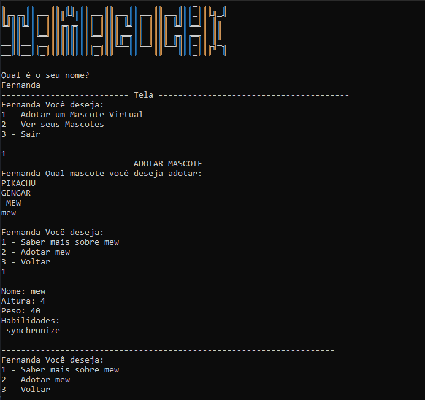

# 👾Tamagotchi 

Console version of the old Tamagotchis, the user can adopt and care for Pokemons.

## 🚀Project Details
The application was developed in C# and .NET7, and searches Pokemon information in the [Pokemon API](https://pokeapi.co/docs/v2). 

The user has the possibility to adopt as many pokemons as he wants, feed them, put them to sleep and play with their pokemons.

## 💻 Stack
- `C# Language`
- `.NET 7`
- `PokéAPI`
- `Json`
